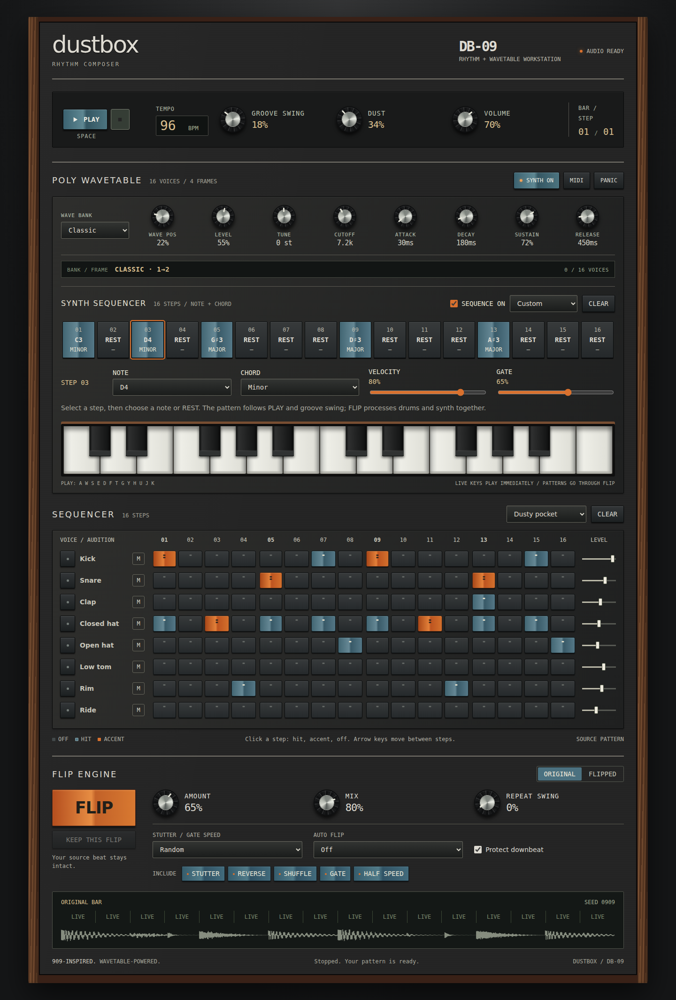

# Dustbox

A lo-fi drum machine, 16-step sequencer, 16-voice wavetable synthesizer and beat-flipping effect for **Logic Pro and other macOS Audio Unit hosts**.



[Native and web interface screenshots](docs/screenshots/README.md)

Put it on a drum loop or drum bus, let a full bar play, and press **FLIP**. The plugin generates a new tempo-synced pattern of stutters, reverse slices, rearranged hits, rhythmic cuts, and half-speed fragments. Keep a pattern you like, or let Auto Flip generate variations at bar boundaries. Downbeat protection keeps the groove anchored by default.

**Version 0.5.0 adds synth note/chord sequencing and fixes live playback across all products. Version 0.4.0 introduced the 16-voice wavetable instrument; version 0.3.1 introduced the Dustbox name and vintage interface.** The portable DSP engine passes behavioral and sanitizer tests. See the current [validation status](docs/VALIDATION.md) before using it in a production session. There is no finished, signed installer.

## Web workstation

The hosted [Dustbox DB-09 web app](https://beat-flip-web.tj25h4ksw8.chatgpt.site) combines the lo-fi 909 drum machine, drum sequencer, FLIP engine, and playable 16-voice wavetable synth with its own 16-step note/chord sequencer. It mirrors the native synth's Classic, Warm, and Spectral banks, four-frame Wave Position morphing, Level, ±24-semitone Tune, low-pass Cutoff, ADSR, panic, on-screen keyboard, computer keys, and optional Web MIDI. Live keys respond immediately throughout playback; programmed synth notes mix with the drums before FLIP.

The refreshed interface uses walnut side panels, charcoal instrument faces, aluminium-centered knobs, orange/blue rocker-style controls, and shaded piano keys. [Desktop, mobile, and native screenshots](docs/screenshots/README.md).

The AU identity, bundle ID and automation parameter IDs retain the original Beat Flip identifiers, so saved projects still recall the same plugin. When upgrading, move the old `Beat Flip.component` out of the Components folder before installing `Dustbox.component` to avoid duplicate AU registrations.

## Wavetable synth — version 0.5.0

### Synth sequencing and live playback — version 0.5.0

All products—the effect AU, Synth instrument AU, both standalone apps, and web app—now include a dedicated **16-step synth sequencer**. Select a step, choose a MIDI note or **REST**, and set **Single / Major / Minor / Sus2 / Octave**, **Velocity**, and **Gate** (10–100% of the swung step). Load **Bassline** or **Chord stabs**, or start blank. **SEQUENCE ON** runs the pattern with Logic's transport or the standalone/web clock; it is independent of PLAY DRUMS. Both patterns share Groove Swing. Native synth steps are automatable and recalled in projects; old projects open with the new sequence empty and off. Web patterns remain session-local.

Live on-screen/computer keys and instrument MIDI are monitored after FLIP, so new notes play immediately at any point in the bar—even at 100% wet. Live notes are no longer sampled once at a bar boundary. To flip synth audio, program the synth sequence: it enters FLIP before processing alongside the drum pattern. PANIC stops the synth sequence and clears live voices; stopping host/web playback stops sequenced notes but leaves live keys playable.

**Dustbox Synth** is a separate MIDI-playable AU instrument. In Logic, create a Software Instrument track and select **Rob James → Dustbox Synth** in the Instrument slot. Play a MIDI keyboard or record notes into a MIDI region. The original **Dustbox** Audio FX keeps its existing AU identity and defaults, so older projects retain their sound.

The new synth panel provides **16 voices**, velocity-sensitive notes, **Classic / Warm / Spectral** banks, continuously morphing Wave Position, Level, ±24-semitone Tune, low-pass Cutoff and **Attack / Decay / Sustain / Release**. Each bank has four interpolated frames and band-limited tables. Classic moves from sine through triangle and saw to square. MIDI pitch bend spans ±2 semitones; CC64 controls sustain. **PANIC** immediately clears held voices. All ten synth parameters support automation and project recall.

Click or drag the two-octave keyboard to play, or focus it and use **A W S E D F T G Y H U J K** for one chromatic octave. Clicking a key enables the synth. Both standalone apps support the on-screen keyboard; choose a MIDI input in the Synth standalone's audio/MIDI settings to use external keys. The synth is enabled by default in the instrument and disabled by default in the effect. The original effect does not receive host MIDI.

Select **Synth only** in the instrument, or **Drum machine** for the backing drum grid. Program the synth sequence and enable SEQUENCE ON to capture notes/chords and drums together. Start Logic's transport and capture a complete bar, then press FLIP. Live MIDI and keyboard notes remain immediately playable with the transport stopped or running; they bypass FLIP. Drum PLAY is independent of the synth keyboard and sequence. EXPORT MIDI continues to export only the drum grid.

## Drum Lab

Choose **Drum machine** as Audio Source, load **Dusty Pocket**, **Warehouse 909**, or **Broken Circuit**, and turn **PLAY DRUMS** on. In Logic, insert Dustbox as an Audio FX on a track and start the host transport. The standalone runs at Free Tempo. **Blank** clears the grid. Click each step to cycle off → hit → accent. Click a voice name to audition it, use M to mute, and adjust its level slider. Muted voices are silent during audition too.

The eight voices are kick, snare, clap, closed hat, open hat, low tom, rim, and ride, synthesized with the web app's voice equations. Closed hats choke open hats. Groove Swing delays alternate drum steps; Repeat Swing separately shapes the FLIP pulses. Dust combines filtering, saturation, reduced bit depth and sample hold. Pattern steps, mutes, levels and all controls are automatable and recalled with the project.

Sequence a beat, let the plugin capture a full bar, then press **FLIP**. Switch **GLITCH ON** off to compare the original. Auto Flip and KEEP work on the sequenced beat. The native engine rearranges captured audio from the previous bar, so grid edits can take a bar to reach glitched slices. This retains the native effect's zero-latency live path; the web app renders whole bars ahead of playback. The two implementations share the workflow and effect families, rather than bit-identical FLIP audio. Bounce the track in your DAW to export the result.

**Audio input** remains the default for compatibility with existing projects. Loading a drum groove selects the drum source. Stop drum playback before changing back to external input if you want the next drum session to remain stopped. New drum parameters use AU version hint 3; all older parameter IDs and version hints are unchanged.

## Controls

| Control | What it does |
| --- | --- |
| **FLIP** | Generates a new pattern and turns Glitch on. The new pattern starts at the next grid step. |
| **Glitch On** | Switches the pattern on/off with a short mix ramp. The input keeps being captured. |
| **Amount** | Sets how many of the 16 cells get glitched. Zero keeps the original beat. |
| **Mix** | Blends the live drums with the flipped version. |
| **Output** | Trims the final output from −24 to +6 dB. |
| **Free Tempo** | Sets the fallback tempo if the host does not supply one. Logic's tempo takes precedence. |
| **Pattern Seed** | A host-automatable parameter. The same seed and controls recreate the same pattern and are saved with the project. |
| **KEEP THIS PATTERN** | Saves the current audible variation as Pattern Seed and turns Auto Flip off. |
| **Stutter / Gate Speed** | Random, or 2, 4, 8 or 16 pulses per grid cell. Random retains the original 2/4/8 behavior. |
| **Repeat Swing** | Delays alternating stutter and gate pulses from 0–75%. Live cells and the main 16-cell grid keep their timing. |
| **Auto Flip** | Generates a new variation every 1, 2, 4 or 8 bar boundaries; Off holds the base seed. |
| **Effect Palette** | Choose any combination of stutter, reverse, shuffle, gate and half speed. With none selected, the effect passes through. |
| **Protect Downbeat** | Keeps cell 1 live. Turn off to let the whole bar change. |
| **Factory Presets** | Loads one of six starting points, preserving your Free Tempo setting. |

The grid labels are **LIVE**, **STUT** (repeat), **REV** (reverse), **JUMP** (a different slice), **CUT** (gate), and **DRAG** (half speed, one octave lower).

## Factory presets

| Preset | Starting point |
| --- | --- |
| **Subtle Pocket** | Sparse shuffle and short repeats, low mix, a little swing. |
| **Stutter Lab** | Dense eight-pulse repeats with the downbeat protected. |
| **Reverse Cuts** | Reversed slices and swung rhythmic gating. |
| **Half-time** | Half-speed fragments at full wet mix, with the first cell live. |
| **Evolving Groove** | Balanced effects, swung repeats, a variation every two bars. |
| **Full Chaos** | All effects, sixteen-pulse repeats, downbeat glitches and a variation every bar. |

Auto Flip derives a repeatable sequence from the saved base seed. It advances across one-bar host loops and restarts from the base after playback restarts, seeks, or tempo/meter changes. It counts bar starts while Glitch is on; cycles that exclude all bar starts cannot advance it. Pressing FLIP restarts the sequence from a new base seed at the next cell. Selecting Off returns to the base pattern; use **KEEP THIS PATTERN** to retain the current automatic variation instead.

Palette, speed and downbeat changes also take effect at the next grid cell. The grid shows the engine's active pattern. Existing 0.1 projects retain their original controls and load the new controls with their original-sound defaults.

## Export drum MIDI to Logic

Click **EXPORT MIDI** to save the current drum grid as a Standard MIDI File (`.mid`). It contains one complete 4/4 bar at 960 ticks per quarter note, on MIDI channel 10. Groove Swing shifts alternate sixteenth notes; accents and track levels become velocities. Muted tracks and zero-level tracks are omitted. The file captures the grid when you click Export and works with playback stopped. It includes the current host tempo when synced, or Free Tempo otherwise.

Drag the file into the Tracks area on a software instrument track loaded with a drum kit, such as Drum Machine Designer. Loop the resulting MIDI region to repeat the pattern. Kit mappings can vary; use this note map to assign pads if needed:

| Voice | MIDI note number |
| --- | --- |
| Kick | 36 |
| Snare | 38 |
| Clap | 39 |
| Closed hat | 42 |
| Open hat | 46 |
| Low tom | 41 |
| Rim | 37 |
| Ride | 51 |

MIDI exports the **source sequence**. Dustbox's drum sounds, Dust processing, FLIP slice effects and output mix are audio processing; bounce the track in Logic to retain those sounds. Export uses a four-quarter-note bar even if the host project uses a different meter.

## Build on your Mac

Requires Xcode or Xcode Command Line Tools, CMake 3.22 or later, Git, and an internet connection for the first JUCE download. [Get CMake](https://cmake.org/download/). If you use Homebrew, `brew install cmake` installs it.

```bash
xcode-select --install # Only if you don't already have Apple's developer tools.
git clone https://github.com/robathanjames/beat-flip-au.git
cd beat-flip-au
bash scripts/build-macos.sh
bash scripts/install-au.sh
auval -v aufx BtFp Rbjm
auval -v aumu DbSy Rbjm
```

The default build creates both universal **Apple Silicon + Intel** AUs and standalone apps:

```text
build-macos/BeatFlip_artefacts/Release/AU/Dustbox.component
build-macos/BeatFlip_artefacts/Release/Standalone/Dustbox.app
build-macos/DustboxSynth_artefacts/Release/AU/Dustbox Synth.component
build-macos/DustboxSynth_artefacts/Release/Standalone/Dustbox Synth.app
```

To build and install only the instrument, use `DUSTBOX_VARIANT=synth bash scripts/build-macos.sh` then `bash scripts/install-au.sh synth`. Use `effect` for only the original effect.

The install script copies the AUs to your user Audio Units folder. Quit and reopen Logic after installation, find **Rob James → Dustbox** in the Audio FX menu, and insert it on a drum track. Use Logic's Plug-in Manager to rescan it if needed. The script stops if a previous installation already exists, so move that version aside before replacing it.

The standalone can play the built-in drum sequencer or route live audio into the effect; it does not load audio files itself. On a Mac, grant microphone permission if you want to use an audio input. For drum files, use the AU in Logic.

If you already have JUCE 8.0.15 locally, configure manually:

```bash
cmake -S . -B build-macos -G 'Unix Makefiles' \
  '-DCMAKE_OSX_ARCHITECTURES=arm64;x86_64' \
  -DCMAKE_OSX_DEPLOYMENT_TARGET=10.15 -DCMAKE_BUILD_TYPE=Release \
  -DBEATFLIP_JUCE_SOURCE_DIR=/absolute/path/to/JUCE
cmake --build build-macos --config Release --parallel 4
```

## GitHub builds

The included workflow runs portable engine tests on Linux, builds both AUs on macOS, and checks preset recall, legacy project migration, KEEP, and the complete audio callback. It also renders an editor PNG under **Beat-Flip-editor-preview**. Processor integration tests exercise both effect and instrument modes. The macOS job installs the component on its runner and runs Apple's `auval`. A completed build attaches ZIPs containing the universal AU and standalone app under **Actions → Build and test Dustbox → Artifacts**.

Those are development builds, without Developer ID signing or notarization. Artifacts are retained even if AU validation fails; check the validation job result before installing. See [validation status](docs/VALIDATION.md).

## Engine tests

The DSP engine has no JUCE dependency. On Linux or macOS:

```bash
bash scripts/test-core.sh
```

Or use CMake:

```bash
cmake -S . -B build-core -DBEATFLIP_BUILD_PLUGIN=OFF -DCMAKE_BUILD_TYPE=Release
cmake --build build-core --parallel 2
ctest --test-dir build-core --output-on-failure
```

Thirteen test groups cover dry transparency, repeatability across buffer sizes, stereo coherence, ring-buffer wrap, source slice accuracy, quantized changes, host loops and seeks, odd meters, effect selection, stutter speed, swung pulse timing, automatic variation, presets, invalid controls, and allocation-free processing. A sanitizer run is also included in CI.

## Hear a generated A/B example

The demo renders a synthetic drum loop: four bars dry, then four bars flipped at 140 BPM. It uses the same engine as the AU.

The downloadable project package includes `Examples/Beat-Flip-AB.wav` so you can hear it before building. The generated WAV is omitted from Git history.

```bash
cmake --build build-core --target beatflip_demo
./build-core/beatflip_demo Beat-Flip-AB.wav
```

With the macOS build, use `cmake --build build-macos --config Release --target beatflip_demo`, then `./build-macos/beatflip_demo`.

## How the effect works

The plugin continuously records the **dry input** into a fixed-size stereo history buffer. It divides each bar into 16 equal cells, aligned to host PPQ and the current time signature. Glitched cells read slices from the previous bar; clean cells use live audio. This keeps the dry path at zero latency while allowing both earlier and later hits from a recorded bar to be rearranged.

It needs a fully captured bar before slices become available. Starting playback partway through a bar can take up to two bars to capture an aligned one. Looping preserves history; seeks, playback restarts, and tempo/meter changes invalidate it and capture a fresh bar. Very slow or unusual meters whose bars exceed 16 seconds pass through safely.

Slice transitions have short ramps; mix and output changes are smoothed. Both channels share the same pattern and timing. Audio processing performs no allocations, locking, file I/O, or UI calls. Parameters and the seed are saved by JUCE's `AudioProcessorValueTreeState`; recorded audio is captured fresh when playback starts.

The FLIP stage changes audio that you hear and bounce. It does not rewrite MIDI regions or send live MIDI to another instrument. Dustbox Synth receives MIDI to generate its own notes. The built-in drum grid can be exported as a MIDI file using EXPORT MIDI. To keep a result as audio, bounce the processed track in your DAW.

## Project layout

| Path | Purpose |
| --- | --- |
| `Source/WavetableSynth.*` | Portable polyphonic wavetable engine. |
| `Source/SynthKeyboard.h` | On-screen and computer-keyboard note input. |
| `Source/GlitchEngine.*` | Portable pattern generator and DSP. |
| `Source/PluginProcessor.*` | AU parameters, transport, state, and audio processing. |
| `Source/PluginEditor.*` | Performance controls, presets, and live pattern grid. |
| `Source/FactoryPresets.h` | The six factory starting points. |
| `Tests/` | Offline engine tests and allocation probe. |
| `Tools/RenderDemo.cpp` | Deterministic synthetic drum A/B renderer. |
| `scripts/` | Build, install, test, and GitHub creation helpers. |
| `.github/workflows/build.yml` | Linux tests and macOS AU build/validation. |

The project fetches [JUCE 8.0.15](https://github.com/juce-framework/JUCE/releases/tag/8.0.15). JUCE is licensed separately; see [license notes](LICENSE-NOTES.md).
