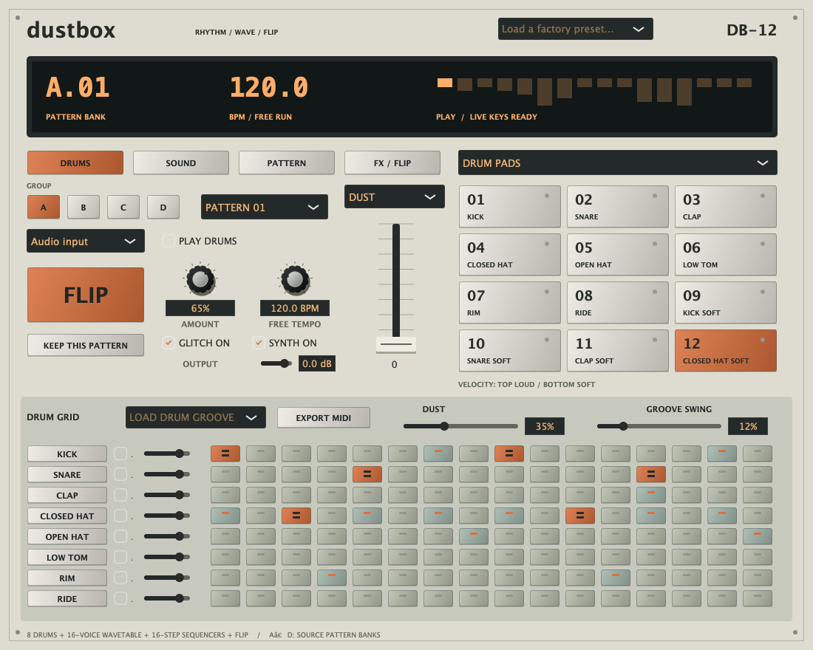
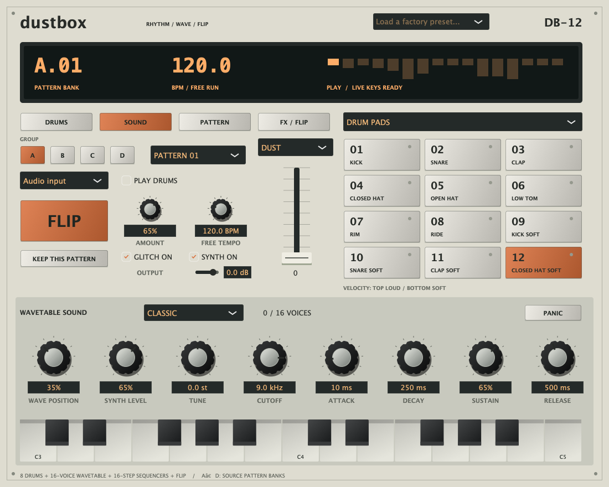
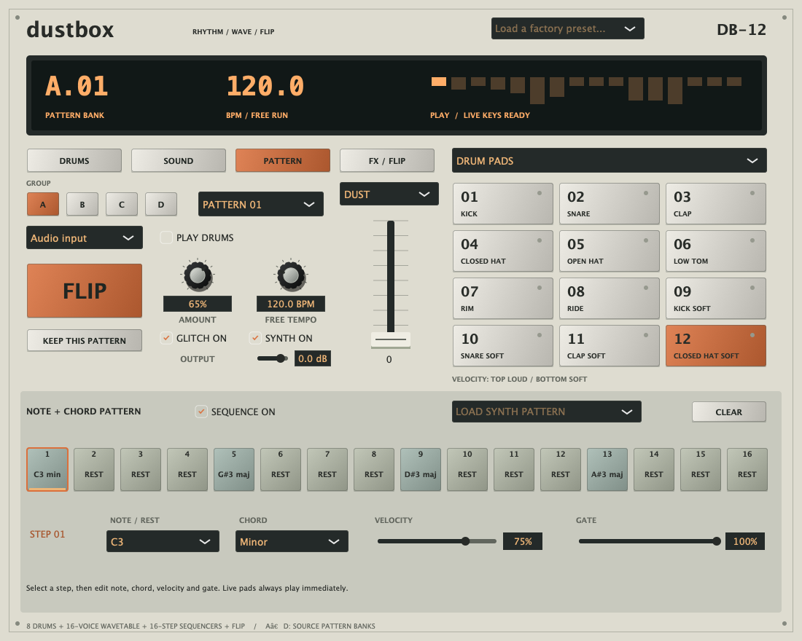
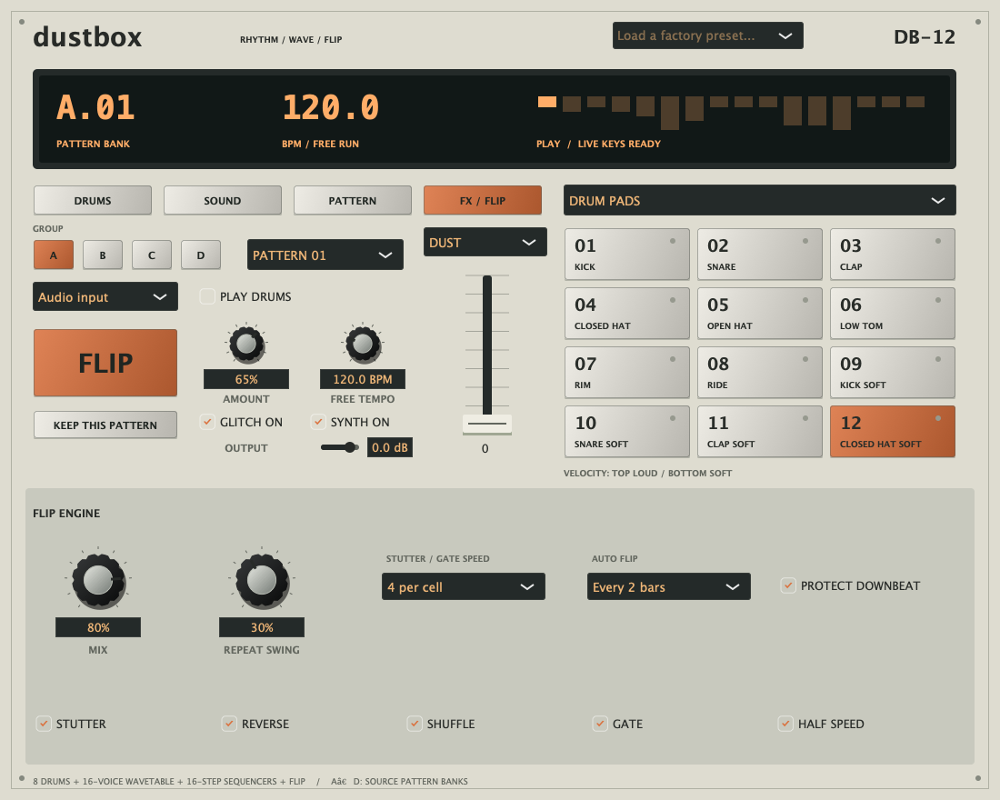
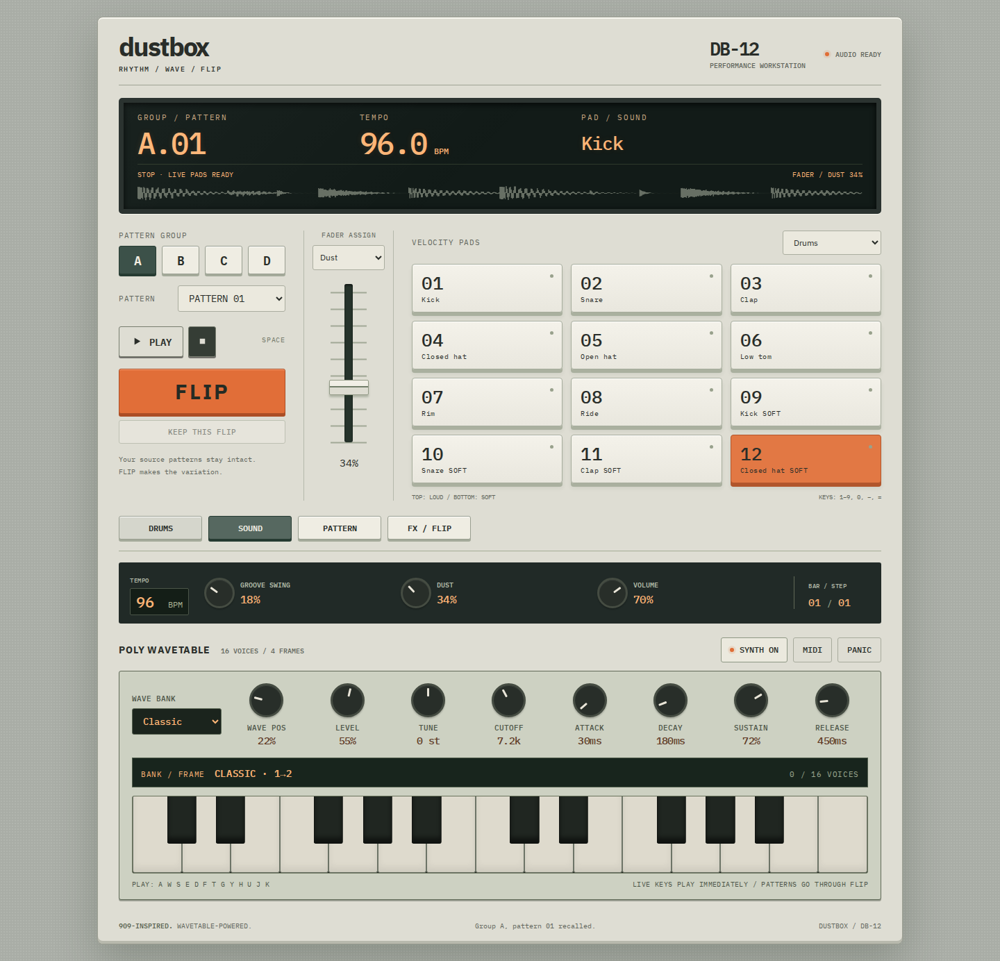

# Dustbox screenshots

## Native performance workstation — version 0.6.0

Actual JUCE editor renders from [build run #40](https://github.com/robathanjames/beat-flip-au/actions/runs/37956928185), source `35e596a86f0899cb39a878375a25ffeaef02ce36`. Both universal AU/standalone products, six native suites and both Apple validators passed. All four 1100 × 880 views were visually reviewed. The snapshots precede the small footer hyphen correction.

## Web performance workstation — version 0.6.0

Actual Chromium renders at 1440 px and 430 px widths from the same tested source. Browser checks cover real audio, live note release, pads, banks, fader behavior and responsive layout. The compact rail and Sound text contrast were reviewed. Mobile step rows scroll within their panel.

## Earlier interfaces

## Native workstation — version 0.4.0 walnut cabinet redesign

Rendered by the macOS processor test runner from the redesigned editor. The universal Audio Unit and standalone build, processor tests, and Audio Unit validation passed in [the build run](https://github.com/robathanjames/beat-flip-au/actions/runs/37727476224).

## Native instrument — version 0.4.0 before the cabinet redesign

Rendered from the tested native editor after the wavetable instrument was merged.

## Previous plugin interface — version 0.3.2

## Version 0.3.2 verification

The interface update was merged in [pull request #4](https://github.com/robathanjames/beat-flip-au/pull/4) after all four checks passed. This screenshot records that release; it is not a live build-status indicator.

