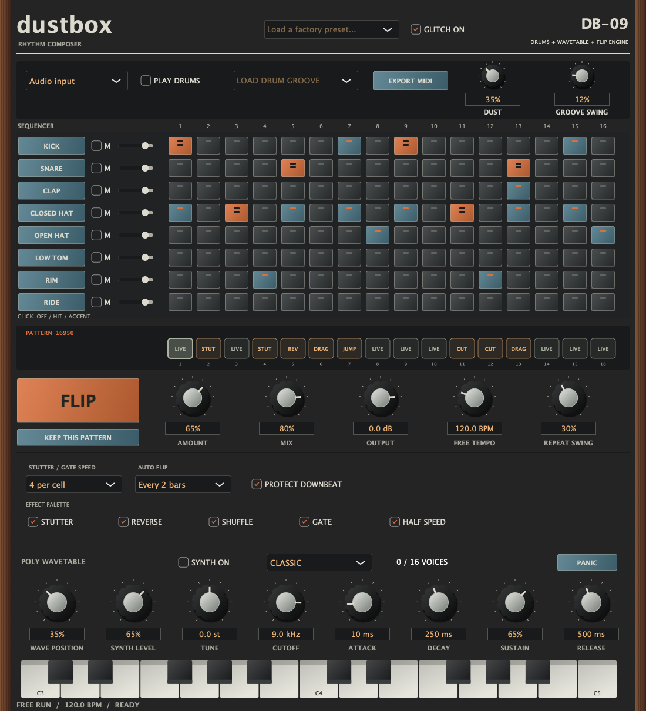
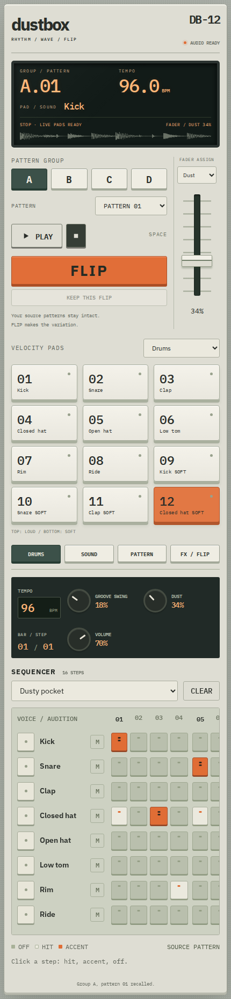
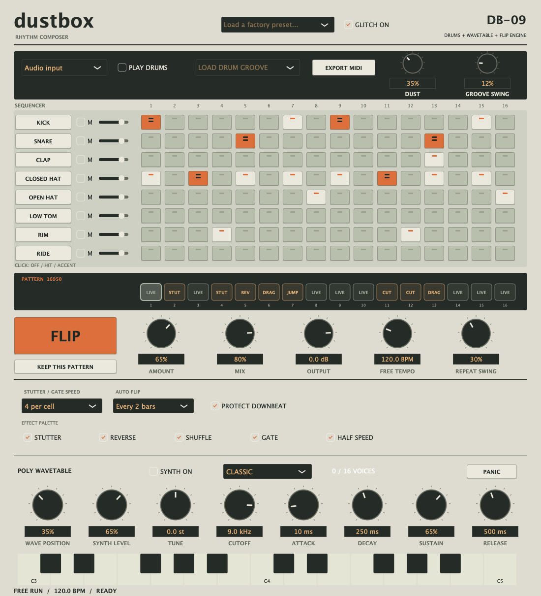

# Dustbox screenshots

## Native workstation — walnut cabinet redesign

Rendered by the macOS processor test runner from the redesigned editor. The universal Audio Unit and standalone build, processor tests, and Audio Unit validation passed in [the build run](https://github.com/robathanjames/beat-flip-au/actions/runs/37727476224).

## Web workstation — walnut cabinet redesign

Captured from the completed browser build at 1440 px and 430 px widths. Both layouts include the new synth, sequencer, and FLIP engine.

## Native instrument — version 0.4.0 before the cabinet redesign

Rendered from the tested native editor after the wavetable instrument was merged.

## Previous plugin interface — version 0.3.2

## Version 0.3.2 verification

The interface update was merged in [pull request #4](https://github.com/robathanjames/beat-flip-au/pull/4) after all four checks passed. This screenshot records that release; it is not a live build-status indicator.

